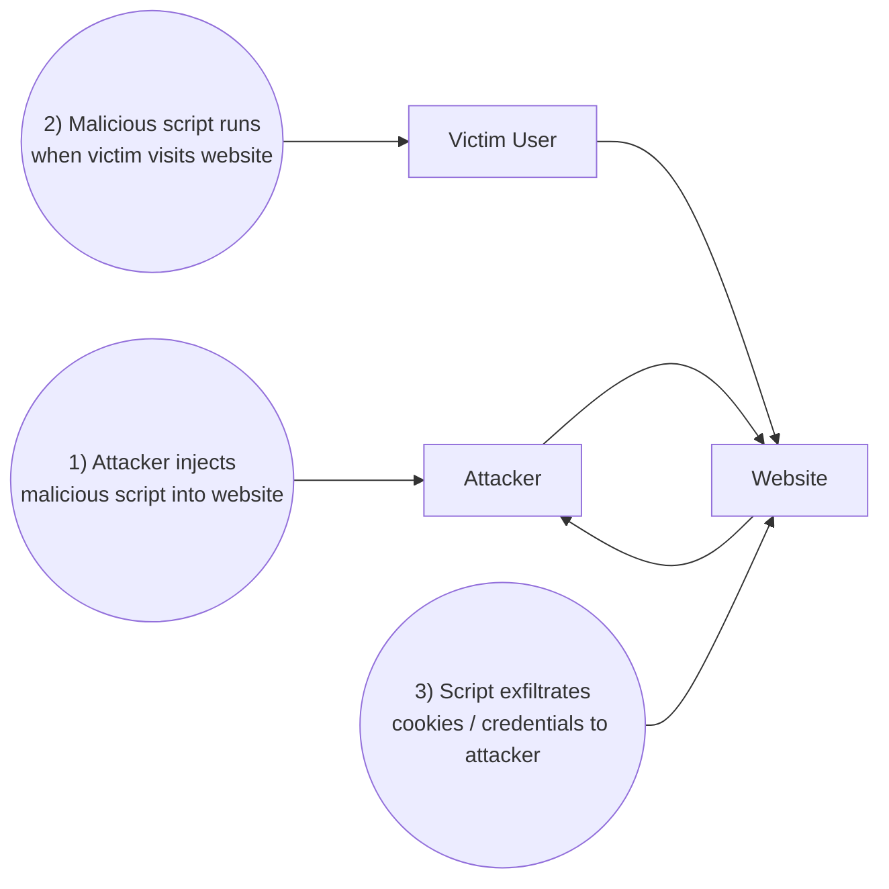

What it is: XSS happens when an attacker injects malicious JavaScript into a web page that runs in other users’ browsers.

once user is able to run script he can any kind of data cookie, keystrokes 


# XSS Attack Diagram

Below is a simple diagram (Mermaid + ASCII fallback) that explains the basic flow of a client-side XSS attack.

---

## Mermaid diagram (use on GitHub / Mermaid-enabled viewers)



---

## ASCII fallback (works in any Markdown viewer)

```
+----------+            1) Injects malicious script          +-----------+
| Attacker | -----------------------------------------------> | Website   |
+----------+                                                  +-----------+
                                                                  ^
                                                                  |
                                                                  | 2) Victim visits; script runs in victim's browser
                                                                  |
                                                           +-------------+
                                                           | Victim User |
                                                           +-------------+
                                                                  |
                                                                  | 3) Script steals cookies/credentials and sends to attacker
                                                                  v
+----------+ <--------------------------------------------------------------+
| Attacker |                                                                |
+----------+                                                                |
                                                                            |
```

---

## How to use

* If your viewer supports Mermaid, the Mermaid block will render a clean diagram.
* If not, the ASCII fallback shows the same flow and can be copied as plain text.

---

## Raw Markdown (copy the whole file)

If you want a single copyable chunk, copy everything in this file. It already *is* a ready-to-save `.md` file.

---

*If you want modifications (labels, colors, or additional steps like "Payload delivered via comment field" or "Stored vs Reflected XSS"), tell me what to change and I will update the file.*
