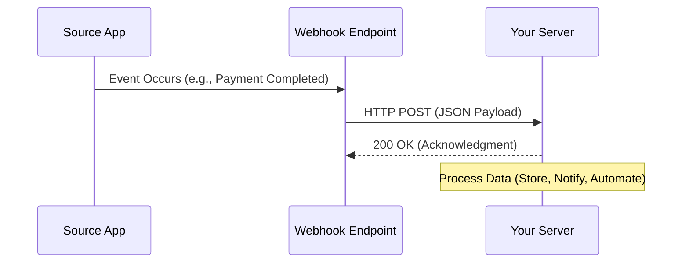

# Webhooks - Notes

## 📘 What is a Webhook?
A **Webhook** is a way for one system to send real-time data to another system whenever a specific event occurs.  
It’s a **server-to-server** communication method that allows **event-driven** updates without constant polling.

---

## ⚡ Real-Time Communication
Unlike APIs that require the client to poll for updates, webhooks **push data automatically** as events happen.

---

## 🔁 Event Driven Architecture
Webhooks fit perfectly in **event-driven systems**, where events (like “payment completed” or “file uploaded”) trigger actions.

---

## 📮 HTTP POST + Payload + Secret
- Webhooks use **HTTP POST** to send **JSON payloads** to your endpoint (URL).  
- Include **authentication or secret tokens** in headers to verify sender identity.  
- Example Header:  
  ```http
  POST /webhook-endpoint HTTP/1.1
  Content-Type: application/json
  X-Signature: abc123xyz
  ```

---

## ❌ Retry Mechanism
If the webhook delivery **fails (like 500 error or timeout)**:
- The sender **retries** after a delay (exponential backoff).
- Example: Stripe, Razorpay, or GitHub retry 3–5 times.
- Use **idempotency** to handle duplicate deliveries safely.

---

## ✅ Verification / Acknowledgment
- Your endpoint should **respond with 2xx (usually 200)** to confirm success.
- Non-2xx responses are treated as failures.
- Example acknowledgment:
  ```js
  res.status(200).send('OK');
  ```

---

## 🧩 Common Use Cases
| Use Case | Description |
|-----------|--------------|
| Notifications | Send real-time alerts like “New message received”. |
| Data Visualization | Update dashboards live when data changes. |
| Automation | Trigger background tasks or workflows. |
| Payments | Payment gateways (like Stripe/Razorpay) send payment status events. |

---

## 🧠 Webhook Flow Diagram


---

## 💻 Example: Node.js (Express)
```js
const express = require('express');
const app = express();
app.use(express.json());

app.post('/webhook', (req, res) => {
  const payload = req.body;
  console.log('Received Webhook:', payload);

  // Verify secret (optional)
  const signature = req.headers['x-signature'];
  if (signature !== 'abc123xyz') {
    return res.status(401).send('Unauthorized');
  }

  // Process event
  if (payload.event === 'payment_success') {
    console.log('Payment successful for order:', payload.orderId);
  }

  res.status(200).send('OK');
});

app.listen(4000, () => console.log('Webhook server running on port 4000'));
```

---

## 🧾 Summary
- **Webhook = Reverse API Call**
- **Real-time, event-driven, and efficient**
- **Use secret keys & retries for reliability**
- **Respond quickly (under 5s) with 200 OK**
