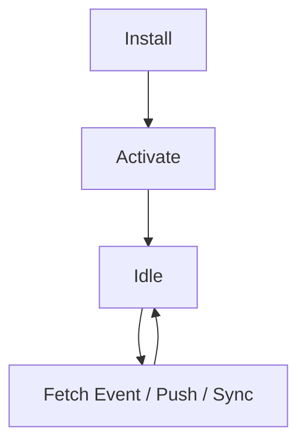

# 🧠 Service Worker — Notes

## 📘 Definition

A **Service Worker** is a **background JavaScript file** that runs in its **own thread** and acts as a **middleware (proxy)** between your **Progressive Web App (PWA)** and the **network (CDN/server)**.

```
Your PWA  ---->  Service Worker  --->  CDN
                    |
                    └──> Your Server
```

It behaves like a **local web server** or **network proxy**, intercepting requests and optionally serving cached content.

---

## ⚙️ Key Characteristics

* Runs on **client-side** within the **browser engine**.
* **Requires HTTPS** (except on `localhost`).
* **Installed** by the web page using:

  ```javascript
  navigator.serviceWorker.register("serviceworker.js", { type: "module" });
  ```
* Has its **own thread** and **lifecycle**.
* Acts as a **network proxy** or **local web server**.
* Can **run in the background** (for sync, notifications).
* **No explicit user permission** required.

---

## 🔍 Debugging / Inspection

Check all installed service workers in Chrome:

```
chrome://serviceworker-internals/
```

---

## 🔄 Lifecycle



* **Install** → Registered by a web page.
* **Activate** → Becomes active and ready to intercept requests.
* **Idle** → Stays dormant until triggered by network activity.
* **Fetch / Push** → Wakes up to handle requests or notifications.

---

## 🍎 Safari / iOS Behavior

* Safari **does not support web push notifications** unless the **PWA is installed**.
* Only the **installed** PWA version can request **web push notifications** — not Safari itself.

---

## 🌐 Scope

* Defines **which pages or paths** the Service Worker controls.
* Can be the **whole domain** or a **specific directory**.
* All requests within scope are handled by the worker.
* Only **one Service Worker per scope**.
* WebKit (Safari) uses **partitioned scopes** for isolation.

---

## 🧩 Registration Example

**In `index.html`:**

```javascript
navigator.serviceWorker.register("serviceworker.js", {
    type: "module"
});
```

**In `serviceworker.js`:**

```javascript
console.log("I am service worker");
```

---

## 💾 Local Cache

Service Workers use the **Cache API** to store resources for offline access.

### Can Cache:

* Static assets (HTML, CSS, JS, images, fonts)
* API responses

### Cache Timing:

* **Prefetch** on installation
* **Cache on demand** (when requested)

---

## ⚡ Cache Serving Strategies

### 1️⃣ Cache First

**Priority:** Cache → Network
Best for static content (e.g., JS, CSS, icons).

```javascript
const urlsToCache = ["/", "app.js", "style.css"];

self.addEventListener("install", event => {
  event.waitUntil(
    caches.open("pwa").then(cache => cache.addAll(urlsToCache))
  );
});

self.addEventListener("fetch", event => {
  event.respondWith(
    caches.match(event.request).then(response => {
      // Cache hit
      return response || fetch(event.request);
    })
  );
});
```

---

### 2️⃣ Network First

**Priority:** Network → Cache (fallback)
Best for dynamic content (API responses).

```
PWA → Service Worker → Network
            ↓
        If fails
            ↓
          Cache
```

```javascript
self.addEventListener("fetch", event => {
  event.respondWith(
    fetch(event.request)
      .then(response => {
        const resClone = response.clone();
        caches.open("pwa").then(cache => cache.put(event.request, resClone));
        return response;
      })
      .catch(() => caches.match(event.request))
  );
});
```

---

### 3️⃣ Stale While Revalidate

**Priority:** Cache (serve fast) → Network (update cache in background)
Combines **speed** and **freshness**.

```
PWA → Service Worker → Serve Cache → Fetch new → Update Cache
```

```javascript
self.addEventListener("fetch", event => {
  event.respondWith(
    caches.open("pwa").then(cache =>
      cache.match(event.request).then(cachedResponse => {
        const networkFetch = fetch(event.request).then(networkResponse => {
          cache.put(event.request, networkResponse.clone());
          return networkResponse;
        });
        return cachedResponse || networkFetch;
      })
    )
  );
});
```

---

## 🧰 Framework Support

### 🔧 Workbox

A **Google library** that simplifies service worker setup.
Provides pre-built caching strategies, routing, and background sync.

```bash
npm install workbox-cli --save-dev
```

Example:

```javascript
import { precacheAndRoute } from 'workbox-precaching';
precacheAndRoute(self.__WB_MANIFEST);
```

---

## ✅ Summary Table

| Feature                | Description                       |
| ---------------------- | --------------------------------- |
| **Runs On**            | Client-side browser thread        |
| **Requires HTTPS**     | ✅ Yes                             |
| **Lifecycle**          | Install → Activate → Idle → Fetch |
| **Acts As**            | Network Proxy / Local Web Server  |
| **Cache API**          | Used for offline & performance    |
| **Push Notifications** | Limited on Safari                 |
| **Scope**              | Domain or specific path           |
| **Framework**          | Workbox                           |
